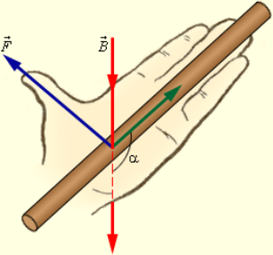

# Сила Ампера
Заряженные тела способны создавать кроме электрического еще один вид поля. Если заряды движутся, то в пространстве вокруг них создается особый вид материи, называемый магнитным полем. Следовательно, электрический ток, представляющий собой упорядоченное движение зарядов, тоже создает магнитное поле. Как и электрическое поле, магнитное поле не ограничено в пространстве, распространяется очень быстро, но все же с конечной скоростью. Его можно обнаружить только по действию на движущиеся заряженные тела (и, как следствие, токи).

Для описания магнитного поля необходимо ввести силовую характеристику поля, аналогичную вектору напряженности E электрического поля. Такой характеристикой является вектор B магнитной индукции. В системе единиц СИ за единицу магнитной индукции принят 1 Тесла (Тл). Если в магнитное поле с индукцией B поместить проводник длиной l с током I, то на него будет действовать сила, называемая силой Ампера, которая вычисляется по формуле:

$F_A=Bll*\sin \alpha$

где: В – индукция магнитного поля, I – сила тока в проводнике, l – его длина. Сила Ампера направлена перпендикулярно вектору магнитной индукции и направлению тока, текущего по проводнику. 

Для определения направления силы Ампера обычно используют правило «Левой руки»: если расположить левую руку так, чтобы линии индукции входили в ладонь, а вытянутые пальцы были направлены вдоль тока, то отведенный большой палец укажет направление силы Ампера, действующей на проводник (см. рисунок).

Если угол α между направлениями вектора магнитной индукции и тока в проводнике отличен от 90°, то для определения направления силы Ампера надо взять составляющую магнитного поля, которая перпендикулярна направлению тока. Решать задачи этой темы нужно так же как и в динамике или статике, т.е. расписав силы по осям координат или складывая силы по правилам сложения векторов.

Момент сил, действующих на рамку с током
Пусть рамка с током находится в магнитном поле, причём плоскость рамки перпендикулярна полю. Силы Ампера будут сжимать рамку, а их равнодействующая будет равна нулю. Если поменять направление тока, то силы Ампера поменяют своё направление, и рамка будет не сжиматься, а растягиваться. Если линии магнитной индукции лежат в плоскости рамки, то возникает вращательный момент сил Ампера. Вращательный момент сил Ампера равен:

$M=NBIS*\sin\alpha$

где: S - площадь рамки, α - угол между нормалью к рамке и вектором магнитной индукции (нормаль - вектор, перпендикулярный плоскости рамки), N – количество витков, B – индукция магнитного поля, I – сила тока в рамке.
